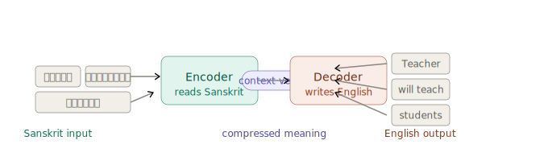

## Assignment 2 Concepts

### Neural Machine Translation (NMT)

#### What is NMT?
Neural Machine Translation (NMT) is a deep learning approach that automatically translates text from one language to another.

Example:
```
English : I love AI.
           │
           ▼
      NMT System
           │
           ▼
French : J'aime l'IA.
```
Instead of translating word by word, NMT tries to understand the meaning of the entire sentence before generating the translation.

### How does NMT work?
At a high level, an NMT system has two parts:

```
English Sentence
       │
       ▼
    Encoder
       │
 Learns the meaning
       │
       ▼
    Decoder
       │
 Generates translation
       ▼
Translated Sentence
```
* Encoder: Reads and understands the input sentence.
* Decoder: Generates the translated sentence in the target language.

### Evolution of NMT
```
Rule-Based MT
      ↓
Statistical MT
      ↓
LSTM Encoder-Decoder
      ↓
Attention
      ↓
Transformers (Modern NMT)
```
Each step improved translation quality by capturing more context and handling longer sentences better.

#### Advantages
* Produces more natural translations.
* Understands sentence context.
* Learns directly from large bilingual datasets.
* Handles complex sentence structures better than traditional methods.

### What is a Seq2Seq model? (As per assignment)
The core idea is simple: you have two neural networks chained together. The first one (encoder) reads the input sentence and compresses it into a fixed-size memory. The second one (decoder) writes the output sentence, drawing from that memory one word at a time.

Think of it like a human interpreter: they listen to an entire Sanskrit sentence, hold the meaning in their head, then speak it out in English.

Here's the big picture — read this, then step through the interactive demo below:



#### Tokenisation — turn words into numbers
A neural network can't read text. Every word gets mapped to an integer ID using a vocabulary dictionary built from the training data.
```
Sanskrit vocab (example): <PAD> → 0, <SOS> → 1, <EOS> → 2 गुरुः → 45, छात्रान् → 112, पाठयति → 89 Input sentence: "गुरुः छात्रान् पाठयति" After tokenise: [45, 112, 89, 2] ← 2 = <EOS> marker
```
The special tokens <SOS> (start) and <EOS> (end) tell the model where a sentence begins and ends. <PAD> fills shorter sentences to a fixed batch length.